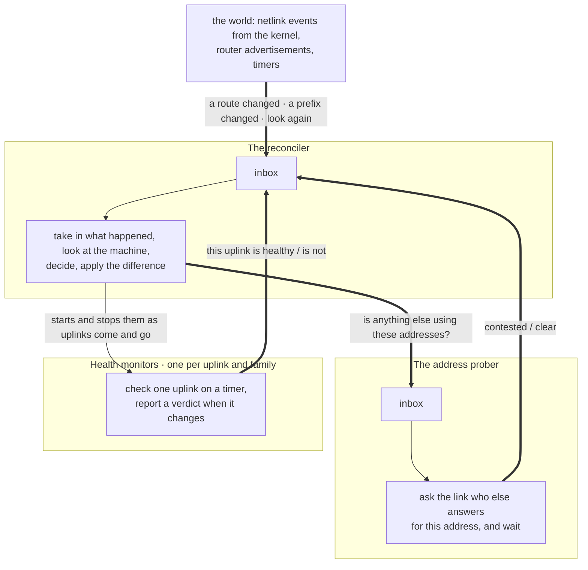

# Architecture

`route-balancer` makes a machine with several upstream connections behave as if
it had one good one. You name the uplinks — a fibre line and an LTE backup, two
ISPs, a tunnel beside a direct link; the configuration calls them gateways — and
the daemon maintains the routing and firewall state that spreads traffic across
them, keeps it off the ones that are not working, and follows each uplink's
address assignment as it changes.

Four things it does. The first is the reason it exists; the rest are opt-in:

- **Load balancing.** Outbound traffic is shared across the uplinks in
  proportion to the weights you give them, and the share is rebuilt whenever an
  uplink gains or loses its connection.
- **Health checking.** Each uplink is tested through its own link, so one that
  is up but not carrying traffic is noticed too. An uplink that fails leaves the
  rotation, and rejoins when it recovers.
- **IPv6 prefix translation (NPTv6).** The network keeps one stable internal
  address plan of its own, and the daemon rewrites traffic leaving through an
  uplink into whatever public prefix that uplink currently holds. An ISP handing
  out a different prefix renumbers nothing inside the network.
- **Answering for translated addresses (proxy NDP).** Some uplinks — a tethered
  phone is the usual one — expect every address in the prefix they give you to
  be present on the link itself. A translated address is held by no interface,
  so the daemon speaks for it, once it has checked that nothing else already
  does.

Traffic to particular destination ports can also be pinned to one uplink instead
of following the shared route.

None of it is configured once and left alone: uplinks come and go, leases
change, and other software on the machine edits the same routing table. The rest
of this page is how the daemon stays correct while that happens.
## How it works

The daemon works in passes. Something wakes it — a default route appeared or
disappeared, a health check changed its mind, an uplink got a new prefix, or the
periodic timer went off — and it looks at the parts of the machine it manages,
works out what they ought to look like, and applies the difference. Then it
waits for the next thing to happen.

Every pass begins by looking, and the daemon keeps no record of what it
installed on the passes before. Installing something for the first time and
putting back something another tool overwrote are therefore the same operation,
and the pass after any change sees the result of that change before it decides
anything. What this costs is that a quiet machine is still re-read from end to
end whenever the timer comes round, and how often that happens is a
configuration setting.

## The three loops

The daemon is made of three kinds of loop.

| Loop | How many | What it does |
|---|---|---|
| **The reconciler** | one, for the whole run | The main loop: it takes in what happened, works out what the routing and firewall state should be, compares that against what the machine actually has, and applies the difference |
| **The address prober** | one, for the whole run | Asks the link whether anything else already answers for an address the daemon is about to answer for, and reports what it heard |
| **The health monitors** | one per uplink and address family, coming and going with the uplinks | Runs one uplink's health check on a timer and reports its verdict when it changes |

The reconciler does nearly all the work. The other two exist because of work it
must not stop to do: asking who else answers for an address means listening for
a few seconds to see if anyone replies, and a health check means waiting for an
answer that may never arrive. Neither can be allowed to hold up a routing
decision, so each waits in a loop of its own and reports back when it knows
something.

Which loops exist and who reports to whom is settled in one place at startup. No
loop goes looking for another, so the reconciler and the prober can be read, and
tested, without reference to each other.

## What they tell each other

Five kinds of message reach the reconciler, and each is either something that
happened or a request to look again: a default route appeared or went away, an
uplink's external prefix changed, a health verdict changed for one uplink and
one address family, the prober ruled on an address, or — sent at startup, on the
timer, and whenever the kernel reports that it dropped notifications — look at
everything.

A message never causes work by itself. It is recorded, and the pass that follows
decides what to do about it, so an ISP renumbering, a flapping link or every
uplink renewing its lease at once all come to a single recalculation.

No loop waits on another. A report that cannot be delivered is dropped and made
again later: a health monitor keeps saying what it thinks until the reconciler
has heard it, and a question about an address that never came back is asked
again.

Shutting down works the same way. A signal reaches every loop at once, each
finishes the turn it is on, the reconciler gets one last turn to take back what
it installed, and the loops started along the way are stopped and waited for.

## Inside a loop

A loop is an **actor**: one thread of control with an inbox — or, for a health
check, with nothing but a timer. Nothing else runs inside it, so what it
remembers belongs to it alone.

A turn begins when the loop picks up everything waiting in its inbox, which is
why a burst of messages costs one turn rather than one turn each. What to do
about them is decided by the loop's **behaviour**: the logic particular to that
loop, holding whatever it remembers between turns, and able to reach nothing on
its own — it cannot look at the machine and it cannot change it.

So a turn starts by asking. The behaviour hands over a batch of **queries** —
what routes are in this table, what addresses this interface has, whether this
health check passes — and is given the answers before it decides anything. It
never goes and looks itself, and it asks for everything at once, so each turn
has a single fixed set of things it saw, and a question asked twice is answered
once.

What the behaviour returns is a list of **actions**: install this route, replace
this rule set, withdraw this entry, start a health check for that uplink. An
action describes a change rather than making one. The actor runs them once the
behaviour has finished deciding, in the order they carry — a routing table is
filled before a rule points at it, and a teardown runs that order backwards.
